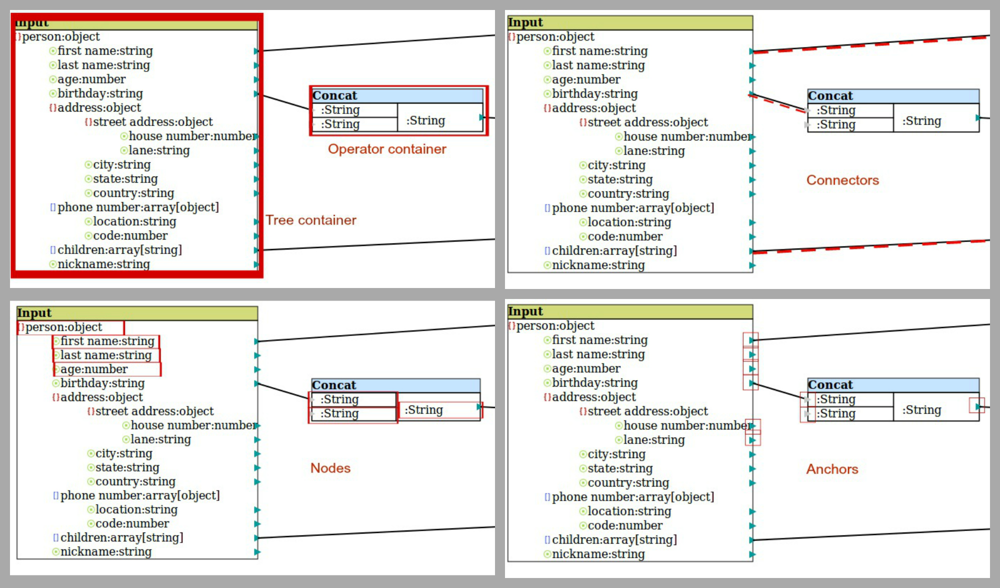

# DataMapperWebApp

As an intern of the WSO2, this is my working project for implementing the wso2 data mapping tool as a static web app.

<a href="WebContent/index.html"> Executable static data mapping tool 
</a>
 

<h2>BackboneJS structure of the app</h2>

<h4>The models of the app are as follows:</h4>

<ol>
<li><b>Operator – </b>The container/operator box with a collection of nodes. Direct mappings are considered to be connected to an operator called “direct”.</li>
<li><b>Container(extending Operator) – </b>Input/output containers</li>
<li><b>Node – </b>The elements of the container. A node has a text, a text type, node type(object, array or leaf) and a type(input or output) which decides the placement of anchor.</li>
<li><b>Anchor – </b>The arrow heads that are assigned to leaf nodes. Anchors of type output are draggable while the others are not.</li>
<li><b>Connector – </b>The line that connects nodes through anchors. Each connector has a source node, source container, target node and target container. </li>
</ol>

<h4>The collections of the app:</h4>
<ol>
<li><b>Operators – </b>a collection of all the operators. The drawContainer function is responsible for drawing a container with the specified input count and output count on the canvas.</li>
<li><b>Connectors – </b>a collection of all the connectors added to the app. The functions include findFromSource and findFromTarget which intakes a node and returns the connectors which have the specified node as the source or target respectively. </li>
<li><b>Nodelist – </b>each container has a collection of nodes. The functions include getNodeFromDOMObject which returns the node  in the collection when the DOM object is specified.</li>
</ol>

<h4>Views initialize the app itself and the important functionalities. </h4>
<ol>
<li><b>Canvas - </b>The app is initiated by the CanvasView which initializes the required views and models of the app. </li>
<li><b>LoadFile – </b>The file handling is managed by the LoadFileView which reads the specified file and draws the tree structure in the container. </li>
<li><b>OperatorPanel – </b>This view is responsible for binding events to operator addition. </li>
</ol>
<h4>The mappings</h4>
At the event of calculating the mappings, the app outputs four arrays:
<ol>
<li><b>Variable list – </b>an array of nodes. The id of the node in the array is used for the adjacency list.</li>
<li><b>Operators – </b>a list of operators in the model, including direct operators.</li>
<li><b>Input adjacency list – </b>each entry of the array corresponds to each operator and the inputs connected to the operator. Assumed that each node has only one input.</li>
[input-nodes-of-op1, input-nodes-of-op2, ….] →  [2, 3] , [1, 2] …..
<li><b>Output adjacency list – </b>each entry of the array corresponds to each operator and the outputs connected to the operator. Assumed that each node can have multiple outputs, which is again an array. </li>
[ [output-nodes-of-op1, output-nodes-of-op2, …... ]  → [ [9], [10, 11] ] , [ [7, 8], [10] ]….
</ol>
